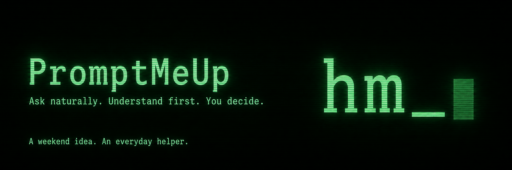
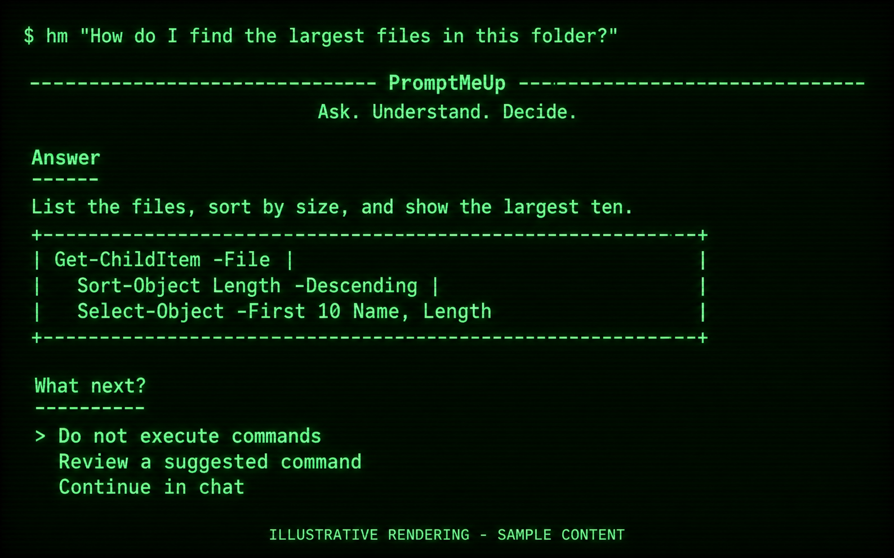
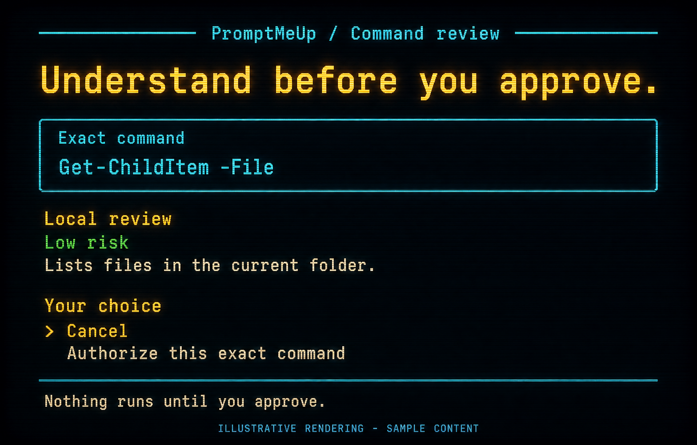
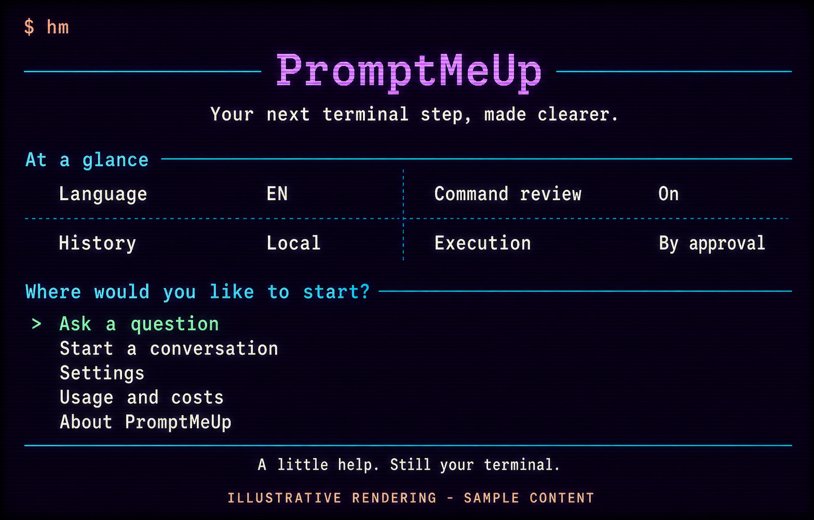

<p align="center">
  
</p>

<h1 align="center">A little help. Still your terminal.</h1>

<p align="center">
  Ask in your own words. Get a clearer next step.<br />
  Run a command only after you have seen it and said yes.
</p>

<p align="center">
  <a href="#meet-hm"><strong>Meet hm</strong></a> ·
  <a href="#try-it-this-weekend"><strong>Try it</strong></a> ·
  <a href="docs/PRIVACY.md"><strong>Privacy</strong></a> ·
  <a href="https://github.com/umbertotechnopreneur/PromptMeUp/discussions"><strong>Join the conversation</strong></a>
</p>

<p align="center">
  <a href="https://github.com/umbertotechnopreneur/PromptMeUp/actions/workflows/quality.yml"></a>
  <a href="LICENSE"></a>
  
  
</p>

## A weekend project that stayed

PromptMeUp started as a **pet project built over a weekend**. Then we kept reaching for it. What began as a small experiment turned out to be more useful than expected in our team at **[UmbertoGiacobbiDotBiz](https://umbertogiacobbi.biz/)**.

So here it is: a small, open-source helper for the everyday terminal questions that interrupt your flow. Still personal. Still evolving. Already earning its place in our working day.

*Yet another CLI AI assistant :-)*

## Meet `hm`

`hm` means **help me**. Tell it what you want to do, read the explanation, and choose your next step.

```powershell
hm "How do I undo my last local commit without losing my changes?"
```

<table>
<tr>
<td width="33%" valign="top"><strong>Ask naturally</strong><br /><br />Describe the outcome. Spend less time trying to remember the right command or flag.</td>
<td width="33%" valign="top"><strong>Understand first</strong><br /><br />Get an explanation in your terminal. Ask a follow-up when you need more context.</td>
<td width="33%" valign="top"><strong>You decide</strong><br /><br />Inspect the exact command and its risk review. Authorize that one command, or cancel.</td>
</tr>
</table>

Nothing in an AI answer runs automatically. Every command starts as a proposal.

## A few moments with `hm`

**One question. A clearer next step.**



<table>
<tr>
<td width="50%" valign="top">
<strong>Pause before you run</strong><br /><br />

<br />See the command. Understand the effect. Make the call.
</td>
<td width="50%" valign="top">
<strong>Your starting point</strong><br /><br />

<br />A question, a conversation, or a quick look at your settings.
</td>
</tr>
</table>

*These are illustrative product renderings with sample content. The retro colors, scanlines, wording, and layouts are presentation treatments, not selectable app themes or exact screenshots. The real interface adapts to your terminal.*

## Small enough to fit your day

- **A quick answer or a short conversation.** Use `hm "…"` or `hm --chat`.
- **Six interface languages.** English, Italian, French, German, Spanish, and Vietnamese.
- **Your terminal stays yours.** No background agent; previous terminal output stays visible.
- **Portable by design.** Windows, Linux, and macOS, with x64 and Arm64 publish targets.
- **Visible usage.** Check session usage, local cost estimates, and optional organization costs.
- **Readable without extras.** High-contrast output works without a special font; emoji and animation can be disabled.

PromptMeUp focuses on terminal tasks. General writing, translation, and image generation are outside its scope.

## Try it this weekend

**Early source preview:** there are no public binary releases yet. The [Releases page](https://github.com/umbertotechnopreneur/PromptMeUp/releases) is where future downloads will appear.

To build locally, install the **.NET 10 SDK**, **Git**, and **PowerShell 7**. AI features use your own OpenAI API account.

```powershell
git clone https://github.com/umbertotechnopreneur/PromptMeUp.git
cd PromptMeUp
dotnet build PromptMeUp.slnx --configuration Release
dotnet run --project PromptMeUp/PromptMeUp.csproj -- --setup
dotnet run --project PromptMeUp/PromptMeUp.csproj -- "How do I list the largest files here?"
```

Setup guides you through language, model, answer style, and command review. Enter credentials through setup or your preferred secret manager; never put a key in a command argument. On Windows, setup can save the key to your current user's environment. On Linux and macOS, an entered key lasts for that process; configure your shell or secret manager for future launches.

After publishing or installing a portable build, the command is `hm`. The [CLI reference](docs/CLI_REFERENCE.md) explains setup, publishing, and the optional user-PATH helpers.

| When you want to… | Use |
| --- | --- |
| Ask one question | `hm "your question"` |
| Keep the conversation going | `hm --chat` |
| Change your preferences | `hm --setup` |
| Check configuration | `hm --status` |
| Understand usage and estimates | `hm --costs` |
| See commands and options | `hm --help` |
| See the libraries behind the app | `hm --third-party` |

## Confidence comes from control

Before execution, `hm` shows the exact command and always runs a deterministic local risk review. An optional AI review can add context, but cannot approve anything. Your approval applies only to that displayed command and expires.

Commands run as your current user through PowerShell, with a timeout and bounded captured output. PromptMeUp is not a sandbox: inspect the command and its effects before authorizing it.

Settings, diagnostic logs, and an audit history stay in local application data. Recognizable credentials are redacted before persistence or AI follow-up. When AI is enabled, the configured provider receives your question, bounded conversation context, a filtered runtime snapshot, and any authorized output used for a follow-up. Redaction is not a guarantee that arbitrary confidential content will be removed.

Read [Privacy and data flow](docs/PRIVACY.md) for the details. OpenAI service terms and API charges are separate from this MIT-licensed app.

## Help shape the next weekend

Found a rough edge? Have a small improvement in mind? Start a [discussion](https://github.com/umbertotechnopreneur/PromptMeUp/discussions), [report a bug](https://github.com/umbertotechnopreneur/PromptMeUp/issues/new/choose), or read the [contribution guide](CONTRIBUTING.md).

Repository writing is in English; the application keeps its six supported languages. Both `AGENTS.md` and GitHub Copilot instructions carry the same rule.

| For users | For contributors |
| --- | --- |
| [CLI reference](docs/CLI_REFERENCE.md) | [Architecture](docs/ARCHITECTURE.md) |
| [Privacy](docs/PRIVACY.md) | [Validation](docs/VALIDATION.md) |
| [Costs and conversation memory](docs/OPENAI_COSTS_AND_CACHING.md) | [Release process](docs/RELEASING.md) |
| [Support](SUPPORT.md) | [Governance](GOVERNANCE.md) |

Security issue? [Report it privately](https://github.com/umbertotechnopreneur/PromptMeUp/security/advisories/new), following our [security policy](SECURITY.md).

## Open source, with credit where it belongs

PromptMeUp is released under the **[MIT License](LICENSE)**. Use it, adapt it, and build on it while keeping the copyright and license notice.

Created by **Umberto Giacobbi**, with appreciation for every contributor and the libraries that make it possible. See [third-party attribution](THIRD_PARTY_NOTICES.md), [upstream license texts](LICENSES/README.md), and [artwork provenance](docs/assets/README.md).

---

<h2 align="center">More from the same workshop</h2>
<p align="center">Useful ideas deserve to make it out of the weekend.</p>

<table>
<tr>
<td width="33%" valign="top">
<h3>TrackMeUp</h3>
Find your workday again. A local-first memory for Windows that helps you recover the context you thought you had lost.<br /><br />
<a href="https://github.com/umbertotechnopreneur/TrackMeUp"><strong>Explore TrackMeUp →</strong></a>
</td>
<td width="33%" valign="top">
<h3>viewsapp.ai</h3>
Curious about what else we are building? Make this your next stop.<br /><br />
<a href="https://viewsapp.ai"><strong>Discover viewsapp.ai →</strong></a>
</td>
<td width="33%" valign="top">
<h3>Umberto Giacobbi</h3>
The person, the products, and the ideas behind the work. Come say hello.<br /><br />
<a href="https://umbertogiacobbi.biz/"><strong>Visit my website →</strong></a>
</td>
</tr>
</table>
