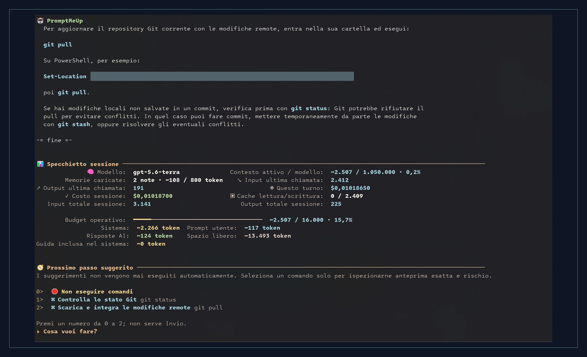
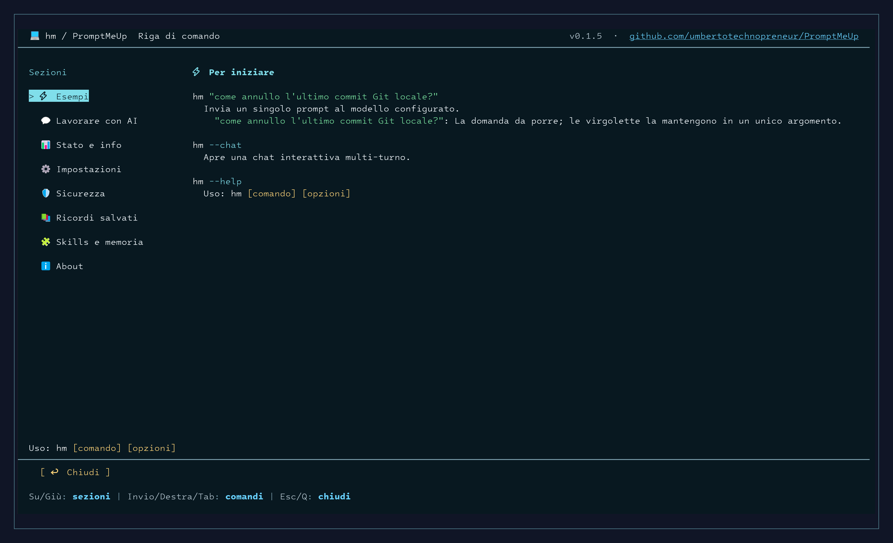
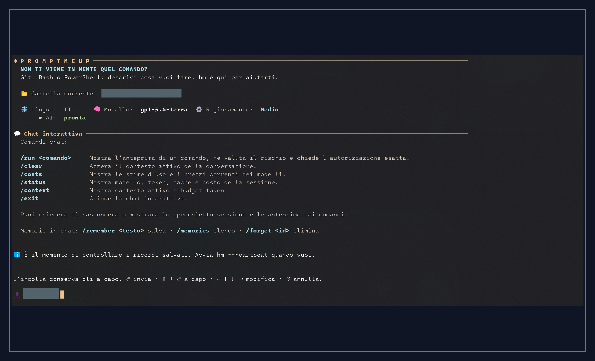
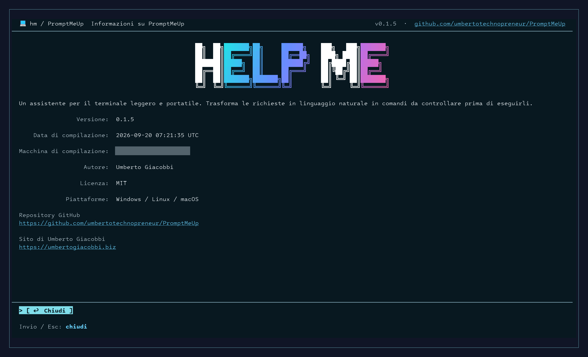

# PromptMeUp — Can't remember that command?

Git, Bash, or PowerShell: describe what you want to do. `hm` is here to help. Available on Windows, Linux, and macOS, using your own OpenAI API account.

<p align="center">
  <a href="#meet-hm"><strong>Meet hm</strong></a> ·
  <a href="#get-started"><strong>Get started</strong></a> ·
  <a href="https://umbertogiacobbi.biz/promptmeup/?utm_source=github&amp;utm_medium=referral&amp;utm_campaign=promptmeup&amp;utm_content=readme_product_page"><strong>Product page</strong></a> ·
  <a href="docs/PRIVACY.md"><strong>Privacy</strong></a> ·
  <a href="https://github.com/umbertotechnopreneur/PromptMeUp/discussions"><strong>Join the conversation</strong></a>
</p>

[](docs/assets/promptmeup-command-it-framed-v1.png)

*Actual app screenshot supplied by the author, shown in Italian. Cropped and framed; the personal path is hidden. Select it to view at full size.*

## Get started

There is no public download yet. To build locally, install the **.NET 10 SDK**, **Git**, and **PowerShell 7**. AI features use your own OpenAI API account.

```powershell
git clone https://github.com/umbertotechnopreneur/PromptMeUp.git
cd PromptMeUp
dotnet build PromptMeUp.slnx --configuration Release
dotnet run --project PromptMeUp/PromptMeUp.csproj -- --setup
dotnet run --project PromptMeUp/PromptMeUp.csproj -- "How do I list the largest files here?"
```

Setup walks you through your language, model, answer style, and command checks. Choose from English, Italian, French, German, Spanish, and Vietnamese. You don't need a special font. Add `--no-emoji` or `--no-animation` if you prefer simpler output.

Enter your API key in setup or use your usual secret manager. Don't put it in a command. On Windows, setup can save the key for your user account. It works right away in the open `hm` session. Before starting `hm` again, fully close and reopen your terminal app — and your IDE too, if that's where the terminal runs. On Linux and macOS, a key entered in setup lasts only for that session; use your shell or secret manager to make it available next time.

The other examples use the shorter `hm` command. When running from source, replace it with `dotnet run --project PromptMeUp/PromptMeUp.csproj --` and keep the same arguments. Ready-to-download builds will appear on [GitHub Releases](https://github.com/umbertotechnopreneur/PromptMeUp/releases).

### Use a portable build

You can make a portable build for Windows, Linux, or macOS on x64 or Arm64. Keep its files together. To use `hm` from any folder, run `hm --path install` from that copy and review the proposed PATH change. Use `hm --path status` to check it or `hm --path remove` to undo it. The [release guide](docs/RELEASING.md#rehearse-a-release) has the build commands.

### Windows installers

The release workflow also prepares EXE installers for Windows x64 and ARM64. They install for your user account and add `hm` to your PATH. PowerShell 7 is still required to execute commands. These installers are unsigned, so Windows may show an unknown-publisher warning. See the [Windows packaging guide](docs/WINDOWS_PACKAGING.md#unsigned-exe-installers-for-x64-and-arm64) for upgrades and other installation methods.

## Before you run a command

Direct mode is on by default for questions and chat. Before a command runs, `hm` shows its exact text, checks the risk locally and with AI, then counts down for five seconds. Press Enter to run now, or Esc or Ctrl+C to cancel. High or critical risk and failed AI reviews block execution. The result goes back to the AI for analysis before any next command is reviewed.

For manual confirmation, open `hm --setup` and turn off **Direct execution (5-second countdown)** in **AI**. `hm --direct "Show the last ten commits"` enables it for one session without changing your saved preference. See the [direct-mode reference](docs/CLI_REFERENCE.md#use-direct-execution) for details. The session summary appears at exit, on `/status`, or when operating context reaches 80%.

Approved commands run through PowerShell with your user account's permissions. They have a time limit and a limit on how much output `hm` captures, but they can still change your real files and system settings. They don't run in an isolated test environment.

Your settings, notes, logs, and request history stay on your machine. To answer you, OpenAI receives your question, recent messages, selected notes, some details about your terminal, and any command output you share for a follow-up. `hm` removes secrets it recognizes, but it can't catch every private detail.

See [what is saved and shared](docs/PRIVACY.md) for the details. The app is MIT-licensed; OpenAI's terms and API charges still apply.

<p align="center">
  <a href="https://github.com/umbertotechnopreneur/PromptMeUp/actions/workflows/quality.yml"></a>
  <a href="LICENSE"></a>
  
  
</p>

> [!NOTE]
> **Distributed MSIX installers are temporarily unavailable.** Use a portable build for now. Maintainers can still create self-signed MSIX packages locally for Windows testing; see the [Windows packaging guide](docs/WINDOWS_PACKAGING.md#install-with-the-hm-execution-alias).

## Meet `hm`

`hm` means **help me**. It is the front door to every PromptMeUp feature: start with a question, open a chat, manage memories, adjust setup, or ask for help with a command, tool, error, file, or script. Start with a question:

```powershell
hm "How do I undo my last local commit without losing my changes?"
```

Read the answer, ask a follow-up, or take a closer look at a suggested command. In direct mode, an eligible command runs only after its five-second countdown; press Esc or Ctrl+C to cancel it. You can also turn direct mode off in setup and approve commands manually.

Each menu choice has a number starting at **0**: with up to ten choices, press its digit to select it immediately; with more choices, type the number and press Enter. Selecting a command opens its exact preview and risk assessment, where you still decide whether to authorize it. If the AI suggests no commands, a single question offers **Finish here** or **Continue in chat**, while an ongoing chat goes straight back to the message prompt.

Have a few questions? Start with `hm --chat`. Your earlier terminal output stays where it was, and `hm` closes when you're done. Nothing keeps running in the background.

In chat and interactive diagnostics, pasted text keeps its line breaks and waits for you to press Enter before sending. Use the arrow keys to review or edit it first. This requires a terminal that supports bracketed paste, which marks pasted text separately from keyboard input; diagnostic files can also be supplied with `--input-file`.

## See the command before you run it

Select a suggested command to read its exact text and risk assessment. Approve it only when you're ready, or cancel and keep chatting.

Run `hm` to browse help or `hm --setup` to open settings. Use the sidebar to change the model, API keys, chat limits, or colors.

<table>
<tr>
<td width="33%" valign="top">
<a href="docs/assets/promptmeup-help-it-framed-v1.png"></a>
<br /><strong>Find a starting point</strong><br />Browse command examples and help.
</td>
<td width="33%" valign="top">
<a href="docs/assets/promptmeup-chat-it-framed-v1.png"></a>
<br /><strong>Keep the conversation going</strong><br />Ask follow-up questions in chat.
</td>
<td width="33%" valign="top">
<a href="docs/assets/promptmeup-about-it-framed-v1.png"></a>
<br /><strong>About the app</strong><br />Find the version, credits, and project links.
</td>
</tr>
</table>

*Real screenshots with matching frames. Personal identifiers are hidden; app text and numbers have not been redrawn. [Image credits](docs/assets/README.md).*

## Remember the details you keep repeating

Save a note directly from the terminal:

```powershell
hm --remember "Prefer short explanations."
hm --remember "I usually work with C# and .NET 10."
hm --forget "the preference about short explanations"
```

`--remember` saves your exact text locally and confirms the saved ID. `--forget` accepts an ID, exact note text, or a description. IDs and exact text need no AI call. Descriptions send batches of saved notes to AI to find matches, with normal token costs. Choose a matching note by pressing its number, then confirm deletion in a separate menu. Press `0` to cancel; `9` shows the next page when needed. Deletion requires an interactive terminal, even with `--yes`. Missing matches, lookup errors, or notes changed during lookup are never reported as deleted. `hm /remember ...` and `hm /forget ...` also use these flows.

Save a preference or a useful project fact from inside chat:

```text
/remember Prefer short explanations.
/remember I usually work with C# and .NET 10.
/memories
```

All saved notes are shared across your chats, wherever you open `hm`. Use `/memories` to see what is saved and `/forget <id>` to remove a note. Existing notes are kept when you upgrade.

Choose **Memories** in the Help or Settings sidebar, or run `hm --memories`, to read, create, edit, and delete saved notes locally. Saving applies immediately; deletion asks for confirmation. Chat and the first question show a compact reminder of the memory commands.

`hm` picks up to five notes to include with a question, using shared words and recency. Saving a note makes no extra AI call. See [how memories work](docs/OPENAI_COSTS_AND_CACHING.md) for the limits and how notes are picked.

## Keep your settings in one place

```powershell
hm --setup
hm --ai-setup
hm --theme
```

These commands open the same Settings screen at General, AI, or Theme. `--ai-settings` also works in place of `--ai-setup`. Pick a section in the sidebar, make your changes, then choose Save or Cancel. You can try theme colors before saving.

Choose **About** in Help or Settings to read about the project. When you close it, you'll be back where you left off, with any unsaved settings still there. You can also type `hm about`.

In chat, `/context` or `/status` shows how much of the conversation `hm` is keeping for the next question. The default limit is **16,000 estimated tokens** — the small pieces of text an AI model reads. You'll also see usage for the last answer and the whole chat. A `~` means the number is an estimate.

Use `/clear` to start fresh in the same chat. Your saved notes and usage totals stay. If a question is too long, `hm` lets you shorten it and try again.

Want less output? Say **“Hide the session summary and command previews”** in chat. You can hide or show either one separately, for example **“Show the session summary”**. The choice lasts for this chat, survives `/clear`, and resets when you start a new chat. Existing terminal output stays in your scrollback.

`/status` and `/context` still show the summary when you ask. Hiding command previews removes the suggested-command menu; commands may still appear in answers. Use `/run <command>` to review one: its exact preview, risk assessment, and approval remain required. Understanding these chat preferences uses an additional AI call, included in usage and cost totals.

## More than a single command

You can give `hm` a build log, ask for a script, or work through a task step by step. Saving a script doesn't run it. Plans and saved routines ask you to approve each command. File previews show what would change and flag files that are already there.

| When you want to… | Use |
| --- | --- |
| Ask one question | `hm "your question"` |
| Keep the conversation going | `hm --chat` |
| Manage saved memories | `hm --memories` |
| Save a note | `hm --remember "note"` |
| Forget a saved note | `hm --forget "id or description"` |
| Diagnose an error or log | `hm --diagnose --file build.log` |
| Draft or revise a script | `hm --script "your request"` |
| Work through a plan and resume it later | `hm --plan "your goal"` |
| See what would happen to your files | `hm --preview copy --file report.txt --output backup` |
| Open settings at AI preferences | `hm --ai-setup` or `hm --ai-settings` |
| Open settings at general preferences | `hm --setup` |
| Open settings at the theme preview | `hm --theme` |
| Check your setup | `hm --status` |
| Check usage and estimated costs | `hm --costs` |
| See commands and options | `hm --help` |
| See the libraries behind the app | `hm --third-party` |

The [command guide](docs/CLI_REFERENCE.md) has more examples and options. PromptMeUp helps with terminal work: commands, tools, errors, files, and scripts. It doesn't write general prose or generate images.

## Experimental skills and learning

On the experimental branch, you can try [skills and reviewed learning](docs/EXPERIMENTAL_MEMORY_SKILLS.md). Start with `hm --skills` or `hm --learning`. Everything starts disabled; Dream and heartbeat suggest memory changes for you to review, and nothing runs in the background.

## A weekend project that stayed

I built PromptMeUp over a weekend and kept using it in my [daily work](https://umbertogiacobbi.biz/promptmeup/?utm_source=github&utm_medium=referral&utm_campaign=promptmeup&utm_content=readme_origin_story), so I shared it. I maintain it with help from a few contributors. Tell me what works for you and what needs fixing.

## Get involved

Found a rough edge? Have a small improvement in mind? Start a [discussion](https://github.com/umbertotechnopreneur/PromptMeUp/discussions), [report a bug](https://github.com/umbertotechnopreneur/PromptMeUp/issues/new/choose), or read the [contribution guide](CONTRIBUTING.md).

Documentation and contributions are in English; the app supports all six interface languages.

| For users | For contributors |
| --- | --- |
| [Command guide](docs/CLI_REFERENCE.md) | [How the code is organized](docs/ARCHITECTURE.md) |
| [Privacy](docs/PRIVACY.md) | [Build and testing guide](docs/VALIDATION.md) |
| [Costs and conversation memory](docs/OPENAI_COSTS_AND_CACHING.md) | [Release process](docs/RELEASING.md) |
| [Support](SUPPORT.md) | [How the project is run](GOVERNANCE.md) |

Security issue? [Report it privately](https://github.com/umbertotechnopreneur/PromptMeUp/security/advisories/new), following the [security policy](SECURITY.md).

## License and credits

PromptMeUp is released under the **[MIT License](LICENSE)**. Use it, adapt it, and build on it while keeping the copyright and license notice.

Created by **Umberto Giacobbi**. Thanks to everyone who contributes and to the people behind the libraries I use. See the [library credits](THIRD_PARTY_NOTICES.md), [license texts](LICENSES/README.md), and [artwork credits](docs/assets/README.md).

## More from MeUp

<p align="center">
  
</p>

<p align="center">
  <a href="https://github.com/umbertotechnopreneur/MailMeUp"><strong>MailMeUp</strong></a> · Connect your inboxes to your AI assistant.<br />
  <a href="https://github.com/umbertotechnopreneur/PromptMeUp"><strong>PromptMeUp</strong></a> · Can't remember that command? Git, Bash, or PowerShell: hm is here to help.<br />
  <a href="https://github.com/umbertotechnopreneur/TrackMeUp"><strong>TrackMeUp</strong></a> · Track your time. Find what you worked on.
</p>

<p align="center"><sub>Brand mark, not an app icon. <a href="docs/assets/meup/README.md">Visual style and image credits</a>.</sub></p>

<p align="center">Built by <a href="https://umbertogiacobbi.biz/">Umberto Giacobbi</a>, with help from contributors.</p>
