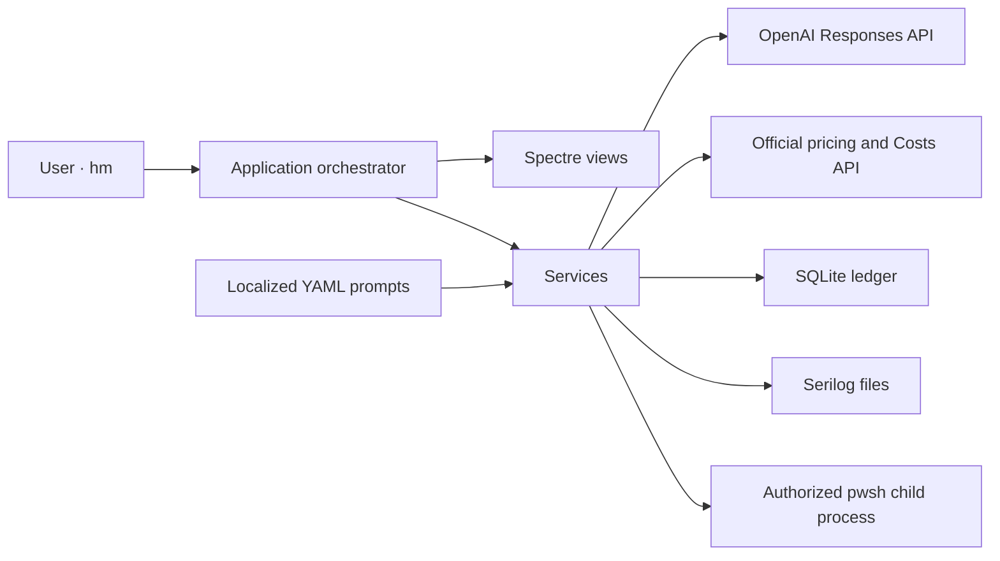
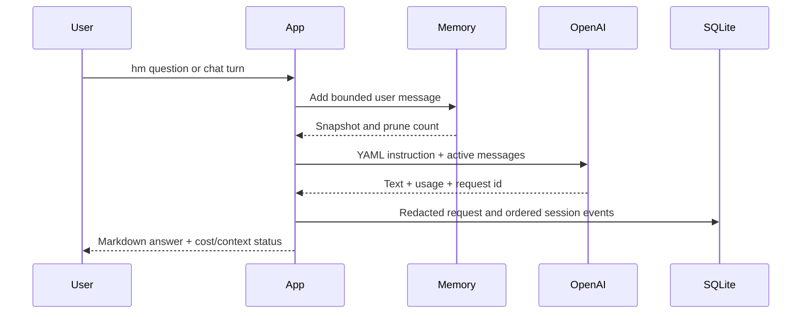

# Architecture

PromptMeUp is one small .NET 10 console host with explicit boundaries between data, behavior, and terminal rendering. It does not automate a graphical interface and it does not run a background agent.

## Layers

- `Models/` contains immutable settings, AI usage, pricing, command authorization, memory, status, and audit contracts.
- `Services/` owns SQLite, OpenAI, pricing, prompt loading, localization, short-term memory, command risk, command execution, secrets, PATH, font support, redaction, and cost calculation.
- `Views/` owns Spectre.Console rendering and user input. Views do not call OpenAI, SQLite, or PowerShell.
- `Application/` coordinates one invocation through focused conversation and authorized-command workflows and is the only place that combines services with views.
- `Infrastructure/` resolves local application paths.
- `/prompt` contains versioned runtime instructions and metadata. `/prompts` contains contributor-facing development prompts and is not sent by the application.

Dependencies are wired through `Microsoft.Extensions.DependencyInjection`. Application code consumes `ILogger<T>`; Serilog is configured only at the composition root.

## AI request flow

The Responses request sets `store=false`. `OpenAiService` owns HTTP, auditing, persistence, and pricing; small request-builder and response-parser components isolate the provider protocol and are tested without network access. Stable YAML instructions precede changing conversation content. Prompt cache routing is enabled by default and usage details are read from the provider response.

## Command authorization flow

1. `/run` captures the exact proposed PowerShell text.
2. A conservative local rule produces a risk score and description.
3. When enabled and available, a redacted command is sent for an advisory AI review; the higher local/AI score wins.
4. The view renders the exact unredacted local command, score, Markdown explanation, and output-sharing notice.
5. Only an affirmative interactive answer creates an `ApprovedCommand` capability.
6. The execution service rejects missing or expired authorization, starts `pwsh -NoProfile -NonInteractive` as the current user, and applies timeout/output limits. PromptMeUp never requests elevation itself; an authorized command can still request it explicitly and is scored accordingly.
7. The user sees local stdout/stderr. Recognizable credentials are redacted before audit persistence and before the bounded result becomes a follow-up prompt.

No AI response can create authorization and `--yes` never applies to `/run`.

## Persistence

SQLite uses WAL mode, foreign keys, integer microdollars, UTC timestamps, and schema version `1`.

| Table | Purpose |
| --- | --- |
| `app_settings` | Singleton non-secret setup and memory settings. |
| `ai_model_pricing` | Daily normalized model price snapshots. |
| `organization_costs` | Optional admin Costs API buckets. |
| `sync_state` | Named synchronization timestamps. |
| `ai_requests` | One normalized provider call, usage, estimated cost, IDs, redacted latest prompt/response, and outcome. |
| `ai_sessions` | Session header, model, language, kind, and lifecycle. |
| `ai_session_events` | Ordered flexible JSON prompt, response, command, output, pruning, and error events. |
| `activity_audit` | Flexible JSON records for setup, authorization, PATH, font, status, and other user activity. |

JSON payloads are validated before insertion. Credential-shaped properties and string values are redacted. SQLite errors are logged; provider results are not replaced by secondary telemetry failures.

## Short-term memory

Each query or chat receives an isolated `ConversationMemory`. It keeps recent user/assistant messages only, caps individual message size, reserves instruction space, and removes oldest complete turns when the turn or token budget is exceeded. It does not summarize or vectorize history.

The persistent event ledger is not reloaded into active context. A new invocation starts with fresh model memory even though its audit trail remains available locally.

## Cross-platform boundaries

- The managed application, SQLite, OpenAI client, rendering, and memory are platform-neutral.
- Authorized commands require PowerShell 7 on every platform.
- Windows setup can persist API keys in current-user environment variables; Unix setup provides export guidance and does not edit a secret profile.
- PATH persistence uses the Windows user environment or one marked Unix profile block.
- Automatic Nerd Font installation is an optional Windows helper; other platforms receive manual guidance.
