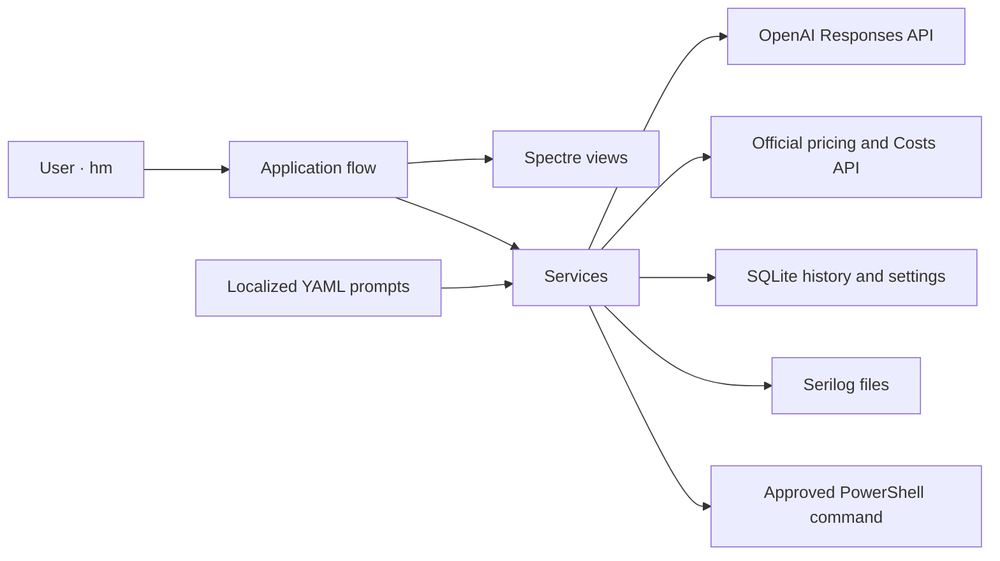
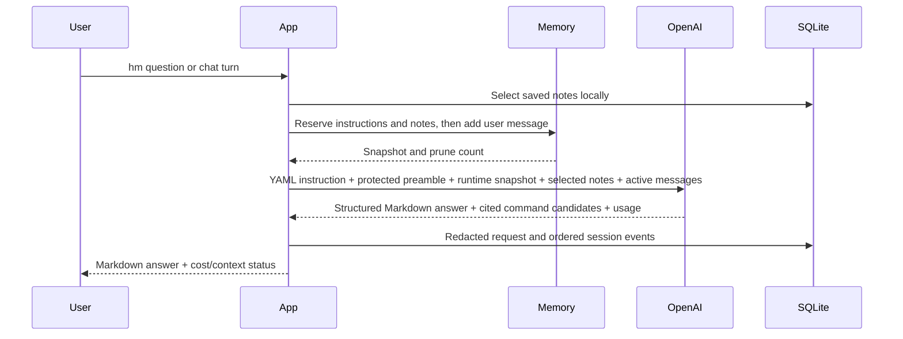

# PromptMeUp architecture

If you're looking through the code, start here. PromptMeUp is a .NET 10 console app that answers terminal questions, keeps notes you choose to save, and asks before running commands. It runs when you start `hm` and closes when you leave.

## Where things live

- `Models/` holds the data types for settings, AI usage, prices, command approval, notes, status, and history. These types are immutable: code creates new values rather than changing them in place.
- `Services/` owns SQLite, OpenAI, pricing, prompt loading, localization, recent conversation memory, saved notes, command risk, command execution, secrets, PATH, font support, redaction, and cost calculation.
- `Views/` owns Spectre.Console rendering and user input. Views do not call OpenAI, SQLite, or PowerShell.
- `Application/` brings services and views together to guide a conversation or an approved command. Other layers keep those jobs separate.
- `Infrastructure/` resolves local application paths.
- `/prompt` contains versioned runtime instructions and metadata. `/prompts` contains contributor-facing development prompts and is not sent by the application.

`Program.cs` connects these parts using `Microsoft.Extensions.DependencyInjection`. Application code logs through `ILogger<T>`. Serilog is set up only in `Program.cs`, where the app is assembled.

`SetupWorkflow` handles settings and API key forms. `InstallationWorkflow` handles reviewed PATH, app-location, and font actions. `ApplicationActivityRecorder` tries to record activity outside a session without blocking completed work if recording fails. `AuditSessionScope` opens and closes sessions, records their outcome, and cleans up after cancellation.

`LennaWorkflow` is a small local display path. The composition root selects it before resolving the main application's settings, theme files, or AI configuration. Its service reads a bounded embedded RGB resource, and its passive view centers a Spectre canvas. It opens no database, calls no provider, and does not clear terminal history.

`HelpWorkflow` also runs before that initialization. Explicit help opens navigable sections in a supported live terminal and keeps grouped scrolling output elsewhere. Invalid command lines use the scrolling reference so the error remains visible. Terminal views use open layouts and separators; cards require an explicit product request.

`hm --setup`, `hm --ai-setup` (also `--ai-settings`), and `hm --theme` enter the same `SetupWorkflow` with General, AI, or Theme selected. The selected section is navigation state; all settings remain available in one draft. An invocation-only `--language` choice changes the form's display language without changing the saved language. Save persists the draft directly, without a summary or confirmation page. Saving does not refresh pricing or call the provider unless the user enables the optional connection check, which defaults to off after initial setup.

UI translations have one definition per key and language in the functionality-grouped `Services/Localization/UiTextCatalog.*.cs` files. Each entry names all six translations explicitly, and catalog assembly rejects duplicate keys. `LocalizationService` retains language selection and culture-aware formatting; runtime AI instructions remain in `/prompt`.

`FullscreenSetupView` implements `ISetupView` and presents the same form pages in a fullscreen workspace or a scrolling section menu. There is no separate legacy wizard or forwarding adapter.
The fullscreen form owns keyboard focus and a temporary alternate terminal buffer;
it returns a draft for `SetupWorkflow` to save. Theme preview changes are reverted
when the view exits and applied after successful persistence. `ThemeCatalogService`
loads validated versioned JSON palettes from the packaged `themes` directory;
settings store only the selected identifier. `hm --theme` selects Theme in the
shared settings workspace.

Fullscreen settings and help share the product header and footer layout. Settings
keeps a sidebar visible from 60 columns, with General, AI, Credentials,
Conversation, Commands, Personalization, and Theme. Switching sections keeps the
local draft until Save or Cancel. Tab reaches those actions, and Left/Right moves
between their buttons. Help uses the same section-navigation
keys and presents colored command examples with matching parameter explanations.
The views keep this presentation separate from command parsing and execution.

## From question to answer

The Responses request sets `store=false`. For chat and single queries, the instruction includes only a privacy-filtered runtime context (working directory, platform/shell, CPU, physical memory, and an available GPU label) so terminal guidance matches the active machine; it excludes account, host, network, serial, and secret data. `OpenAiService` owns HTTP, auditing, persistence, and pricing; small request-builder and response-parser components isolate the provider protocol and are tested without network access. Stable YAML instructions precede changing conversation content. Prompt cache routing is enabled by default and usage details are read from the provider response.

One HTTP deadline covers sending and reading the bounded response body, and recorded duration includes body delivery. Runtime context requests PowerShell 7 syntax on Windows, Linux, and macOS, with paths appropriate to the host.

The system prompts constrain the assistant to Windows, macOS, and Linux console help. They explicitly exclude image generation and ordinary prose editing. An optional setup preamble is Unicode-normalized, capped at 500 words, screened for multilingual instruction overrides and role forgery, and enclosed in a dedicated untrusted-data block. The localized YAML prompt tells the model to apply only compatible style or format preferences from that block. The Responses API uses a strict JSON schema for the rendered Markdown answer and any cited command candidates. The model has no tool or process-execution capability.

## What happens when you approve a command

1. `/run` captures the exact proposed PowerShell text.
2. A conservative local rule produces a risk score and description.
3. A redacted command is sent for AI review when enabled, and always in direct mode. The higher local/AI score and severity win independently.
4. The view renders the exact unredacted local command, score, Markdown explanation, and output-sharing notice.
5. `AuthorizedCommandWorkflow` creates an `ApprovedCommand` only after the shared preview and the selected interaction gate: manual confirmation or the five-second direct countdown. Direct mode refuses high, critical, unknown, or incomplete reviews before opening the countdown.
6. The execution service rejects missing or expired authorization, starts `pwsh -NoProfile -NonInteractive` as the current user, and applies timeout/output limits. PromptMeUp never requests elevation itself; an authorized command can still request it explicitly and is scored accordingly.
7. The user sees local stdout/stderr. The workflow then prepares one bounded, redacted result for audit and downstream consumers. The versioned six-language `command-result` prompt formats the same evidence for AI follow-up; local previews retain their exact text.

No AI response can create authorization and `--yes` never applies to `/run`. `CommandExecutionMode` is selected from local settings or the explicit CLI switch, never from model output. Direct mode is enabled by default and can be disabled in setup. A single suggestion goes to review automatically; multiple alternatives retain the selection menu. `CommandAuthorizationView` shares the full preview and output rendering, while `CommandCountdownView` owns only countdown rendering and keyboard decisions. Execution, audit, redaction, and the result-analysis loop remain shared. Each automatic chain stops after eight commands.

Conversation summaries are hidden by default. Snapshot construction reads retained context without selecting notes again or pruning history. One ledger query returns session usage and cost together, including command-risk reviews under the owning session ID. Review calls never close the owning flow. Provider-confirmed usage is retained if cancellation arrives during pricing or persistence.

At exit, including cancellation, the workflow refreshes the snapshot from current state and the ledger with a two-second local-read deadline independent of the canceled execution token. It makes no AI call. If that read fails, the UI explicitly marks totals unavailable and preserves the original flow error. Explicit status requests and usage at or above 80% of the effective context budget override hiding. A question that continues into chat shares its mode, history, and final summary.

## How data is saved

SQLite uses WAL mode, foreign keys, integer microdollars, UTC timestamps, and schema version `5`. Initialization upgrades older supported databases in a transaction, retaining settings and history. Version 5 adds the default-on `direct_mode_enabled` preference; version 4 made every saved note global. A database from a newer schema is rejected.

| Table | Purpose |
| --- | --- |
| `app_settings` | Singleton non-secret setup and memory settings. |
| `persistent_memories` | Saved note text, ID, last-updated timestamp, and a compatibility scope column written as `global`. |
| `ai_model_pricing` | Daily normalized model price snapshots. |
| `organization_costs` | Optional admin Costs API buckets. |
| `sync_state` | Named synchronization timestamps. |
| `ai_requests` | One normalized provider call, usage, estimated cost, IDs, redacted latest prompt/response, and outcome. |
| `ai_sessions` | Session header, model, language, kind, and lifecycle. |
| `ai_session_events` | Ordered flexible JSON prompt, response, command, output, pruning, and error events. |
| `activity_audit` | Flexible JSON records for setup, authorization, PATH, font, status, and other user activity. |

JSON is checked before saving, and recognizable secrets are removed from fields and strings. SQLite errors are logged. A failure to record activity doesn't replace an answer already received from OpenAI.

## Scripts, plans, and helpers

Scripts and plans use the same size limit for reading and writing,
with a separate AI output limit; see
[configuration](CLI_REFERENCE.md#configure-artifact-limits).

Plans and scripts share `AtomicFileWriter` for temporary-file publication and cleanup. Callers retain validation and localized errors and explicitly select overwrite behavior: plans replace progress files, while scripts require a new destination.

Commands and font helpers share bounded process I/O and cancellation cleanup.
Large approved commands travel over standard input. Font checks time out after
15 seconds; installation after two minutes. Command approval remains mandatory.

## Recent conversation and saved notes

Each query or chat receives an isolated `ConversationMemory`. It keeps recent user/assistant messages, caps user-input size, and removes the oldest complete turns to fit the turn and token limits. The default is 12 turns. Completed answers are rendered before pruning; an oversized completed turn can be dropped entirely from future context. There is no automatic summary.

`PersistentMemoryService` stores notes explicitly saved through memory commands or the editor; approved Dream proposals also create saved notes. All notes share one collection in the local data folder, independent of the working directory. Each note is limited to 1,000 characters; new notes are accepted below a total of 100. Migrated collections above that limit stay readable, editable, and deletable. Saving identical text refreshes one existing note, without removing any preserved duplicates.

Selection uses local Unicode word overlap, with no provider call or embedding index. All notes are eligible; candidates are sorted by overlap, recency, and ID. Selection removes duplicate text and keeps at most five notes within a 650-token content estimate. The localized `memory-context.yaml` wrapper and JSON note list form a user message capped at 800 estimated tokens; lower-ranked notes are removed until it fits. That message is prepended once per request and is not added to the conversation window.

New notes containing recognizable credentials are rejected. Reads reapply redaction and repair stored text when needed. Invalid note input leaves chat open; invalid stored data and database failures propagate rather than silently dropping memories.

The event ledger is not replayed into context. A new invocation starts with fresh recent messages and may recall saved notes. `/clear` removes recent messages while preserving saved notes, local history, the latest response metrics, and cumulative session usage. `/forget` deletes the selected note record; it does not rewrite old requests or retained assistant replies.

## Context budget and usage

For ordinary questions and chat, the input budget is the smallest of:

- the saved `ContextTokenBudget` (16,000 by default), or the `PROMPTMEUP_CONTEXT_TOKENS` override when present;
- the configured percentage of the model's context window;
- the model's context window minus the reserved response budget.

The saved budget and environment override accept 4,000–200,000 tokens. The environment value affects the current process and is not persisted. Plans and scripts use their separate artifact limits.

Before adding a question, `AiConversationWorkflow` reserves the populated instructions, runtime details, and selected notes, then gives the remaining input allowance to recent messages. If the new question and those fixed parts cannot fit, the request is rejected before an HTTP call. In chat, the limit error leaves the conversation open so the user can shorten the question or clear recent messages.

`ContextTokenEstimator` uses UTF-8 byte count divided by four, rounded up, with small message/request allowances. This is a local estimate, not provider tokenization. The status display marks it with `~` and compares retained input against both model capacity and the effective input budget. `/status` and `/context` recalculate this estimate, including any newly selected notes.

The latest response's provider input/output counters are kept separately in `ConversationState`. Cumulative input/output counts come from the session's recorded `ai_requests`. These counters describe usage already incurred; neither pruning nor `/clear` resets them. Diagnostic connection tests show their own latest-call usage without a retained chat-context estimate.

## Differences between operating systems

- The managed application, SQLite, OpenAI client, rendering, and memory are platform-neutral.
- Authorized commands require PowerShell 7 on every platform.
- Windows setup can persist API keys in current-user environment variables; Unix setup provides export guidance and does not edit a secret profile.
- PATH persistence uses the Windows user environment or one marked Unix profile block.
- Automatic Nerd Font installation is an optional Windows helper; other platforms receive manual guidance.
